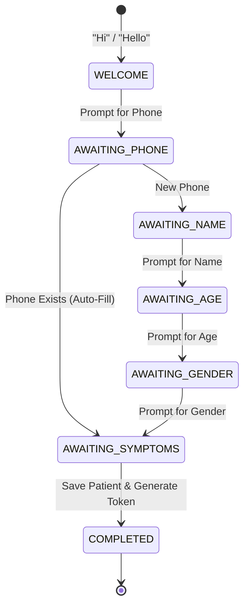

# CareSync: Smart Hospital Queue & Management System Overview

CareSync is a premium full-stack real-time hospital queue management system designed to eliminate physical waiting lines, automate walk-in and virtual token registration, and streamline doctor-staff cabin workflows.

---

## 1. Core Architectural Features

### A. Patient Chatbot State Machine (`ChatSession`)
* **First Impression:** When a patient visits the portal, they are greeted by a distraction-free, clean chat interface.
* **State Engine:** Tracked in MongoDB via `ChatSessionSchema`. The patient progresses through sequential enum stages:
  1. `WELCOME`: Awaiting greetings (e.g. "Hi", "Hello").
  2. `AWAITING_PHONE`: Prompts for the phone number.
  3. `AWAITING_NAME`: If the phone matches an existing patient, the chatbot pulls the record, says *"Welcome back!"*, and skips directly to step 6 (`AWAITING_SYMPTOMS`). If new, it prompts for the name.
  4. `AWAITING_AGE`: Prompts for the age.
  5. `AWAITING_GENDER`: Prompts for the gender.
  6. `AWAITING_SYMPTOMS`: Prompts for active symptoms.
  7. `COMPLETED`: Consolidates variables, creates/saves a new `Patient` record, initializes a `Token` and places it in the assigned doctor's queue.
* **Temporary Storage:** Active session records hold values in a `tempData` buffer object before committing them to the database, ensuring zero dangling, incomplete patient profiles.



### B. Emergency Queue Prioritization (SOS)
* **Logic:** Staff members can trigger an **Emergency Override** flag during registration, or change an existing ticket to SOS.
* **Priority Routing:** Emergency tokens are pushed to **Index 0** of the doctor's `activeQueue` array, instantly routing them to the top of the waitlist.
* **Safety Constraint:** Emergency tokens never interrupt, eject, or overwrite the `currentToken` already inside the doctor's cabin, allowing the doctor to safely finish their current patient.

### C. Live Doctor Cabin Buffer Control
* **Problem:** Some patients take longer than the average checkup estimate, creating queue delays.
* **Solution:** Doctors can add manual buffer offset delays (e.g., `+10`, `+15`, `+30` mins) from their control panel.
* **Instant Calculation:** The backend immediately recalculates the estimated wait time for all downstream patients using the formula:
  $$\text{Wait Time} = (\text{Position in Queue} \times \text{Average Checkup Time}) + \text{Buffer Delay}$$
* **Broadcast:** Updated wait times are immediately broadcasted to all active client screens via WebSockets.

### D. Midnight Maintenance (Cron Job)
* **Timing:** Triggers automatically at 12:00 AM daily.
* **Operations:**
  1. Backs up and saves all active tokens into the `ArchivedToken` collection.
  2. Wipes the active `Token` and `ChatSession` collections.
  3. Resets doctor queues, buffer delays, and current cabin tokens to `null`/`0`.
  4. Resets the token index sequence back to `T-101`.

### E. Speech Synthesis Calling
* When a doctor calls a patient, the web browser triggers the native **Web Speech API** to announce the called token number (e.g. *"Token T-101, please proceed to Cabin 101"*), giving hands-free audio queues.

### F. Re-visit Appointment Reminder System
* **Doctor Setup:** When completing a checkup, doctors can select a re-visit timeline (e.g., in 7 days). This creates a pending `Reminder` entry.
* **Daily Cron Processing:** Every morning at 9:00 AM, a cron task finds pending reminders scheduled for the day, sends a simulated SMS alert, and updates their status to `Sent`.
* **Testing Dispatcher:** Staff members can trigger pending reminders manually via the dashboard for verification.

---

## 2. Database Schema (Mongoose Models)

### 1. Patient (`PatientSchema`)
* Keeps demographic and contact records.
* Fields: `name`, `phone`, `age`, `gender`, `visitHistory` (references to completed tokens).

### 2. Doctor (`DoctorSchema`)
* Credentials and department classification.
* Fields: `name`, `email`, `passwordHash`, `department`, `specialization`, `availabilityStatus` (`Available`, `In Surgery`, `On Break`), `averageCheckupTime`, `currentRoom`.

### 3. Staff (`StaffSchema`)
* Receptionist logins.
* Fields: `name`, `username`, `passwordHash`, `counterNumber`.

### 4. Token (`TokenSchema`)
* Active daily tickets in queue.
* Fields: `tokenNumber` (e.g. `T-101`), `patient` (Reference), `doctor` (Reference), `tokenType` (`Regular` or `Emergency`), `status` (`Waiting`, `Active`, `Completed`, `Absent`), `symptoms`, `estimatedWaitTime`.

### 5. Queue (`QueueSchema`)
* Coordinates cabin queues.
* Fields: `doctor` (Reference), `currentToken` (Reference), `activeQueue` (Array of Token References), `bufferDelay` (Number).

### 6. ChatSession (`ChatSessionSchema`)
* Tracks chatbot flow progress.
* Fields: `sessionId`, `currentStep`, `tempData` (object holding phone, name, age, gender, symptoms, doctorId), `chatHistory` (array of sender/message strings).

### 7. Reminder (`ReminderSchema`)
* Holds pending and sent patient re-visit reminders.
* Fields: `patient` (Reference), `doctor` (Reference), `token` (Reference), `scheduledDate` (Date), `revisitDays` (Number), `status` (`Pending`, `Sent`, `Cancelled`), `message` (String), `sentAt` (Date).

---

## 3. Core API Endpoints

### Auth Routes (`/api/v1/auth`)
* `POST /staff/login` - Authenticates reception staff.
* `POST /doctor/login` - Authenticates clinical doctors.

### Chat Routes (`/api/v1/chat`)
* `POST /message` - Feeds client messages to the chatbot state machine and returns responses.

### Staff Actions (`/api/v1/staff`)
* `GET /queues` - Fetches global queues and doctor parameters.
* `POST /tokens/walk-in` - Direct walk-in booking tool.
* `PUT /tokens/:id/status` - Manually updates a token's status.
* `PUT /tokens/:id/override` - Elevates a regular token to SOS.
* `GET /reminders` - Fetches all scheduled reminders.
* `POST /reminders/trigger` - Instantly processes and triggers pending reminders for testing.

### Doctor Controls (`/api/v1/doctor`)
* `GET /my-queue` - Fetches doctor's specific cabin status.
* `PUT /availability` - Adjusts status (e.g. *On Break*).
* `POST /queue/call-next` - Admits the front-most queue patient.
* `POST /queue/complete` - Concludes checkup. Accepts optional `{ revisitDays: Number }` to schedule a re-visit reminder.
* `POST /queue/mark-absent` - Marks patient absent.
* `POST /queue/add-buffer` - Adds time offset delay.

---

## 4. Folder Structure (Isolated Design)

```
hospital_management/
│
├── backend/                  # Isolated Node.js Express Project
│   ├── models/               # Mongoose DB Collections
│   ├── routes/               # Express REST Routes
│   ├── utils/                # In-memory simulator & helper routines
│   ├── .env                  # Environment Variables (Database URLs, Port settings)
│   ├── index.js              # Server entry point & Socket.io controller
│   └── package.json          # Backend-specific package scripts
│
├── frontend/                 # Isolated Vite React Project
│   ├── src/                  # React JSX views and styling
│   │   ├── main.jsx          # SPA entry point
│   │   ├── App.jsx           # Unified UI Dashboard panels
│   │   └── index.css         # CSS base variables & flashing animations
│   ├── index.html            # Core layout root template
│   ├── tailwind.config.js    # Tailwind styling rules
│   └── package.json          # Frontend-specific package scripts
│
└── .gitignore                # Roots ignores (node_modules, .env, dist)
```
