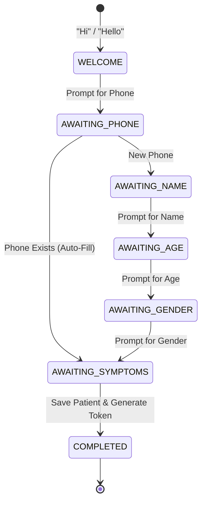

# CareeAi: Smart Hospital Queue & Management System Overview

CareeAi is a premium full-stack real-time hospital queue management system designed to eliminate physical waiting lines, automate walk-in and virtual token registration, and streamline doctor-staff cabin workflows.

---

## 1. Core Architectural Features

### A. Patient Chatbot State Machine (`ChatSession`)
* **First Impression:** When a patient visits the portal, they are greeted by a distraction-free, clean chat interface.
* **State Engine:** Tracked in MongoDB via `ChatSessionSchema`. The patient progresses through sequential enum stages:
  1. `WELCOME`: Awaiting greetings (e.g. "Hi", "Hello").
  2. `AWAITING_PHONE`: Prompts for the phone number.
  3. `AWAITING_NAME`: If the phone matches an existing patient, the chatbot pulls the record, says *"Welcome back!"*, and skips directly to step 6 (`AWAITING_SYMPTOMS`). If new, it prompts for the name.
  4. `AWAITING_AGE`: Prompts for the age.
  5. `AWAITING_GENDER`: Prompts for the gender.
  6. `AWAITING_SYMPTOMS`: Prompts for active symptoms.
  7. `COMPLETED`: Consolidates variables, creates/saves a new `Patient` record, initializes a `Token` and places it in the assigned doctor's queue.
* **Temporary Storage:** Active session records hold values in a `tempData` buffer object before committing them to the database, ensuring zero dangling, incomplete patient profiles.


```mermaid
stateDiagram-v2
    [*] --> WELCOME : "Hi" / "Hello"
    WELCOME --> AWAITING_PHONE : Prompt for Phone
    AWAITING_PHONE --> AWAITING_SYMPTOMS : Phone Exists (Auto-Fill)
    AWAITING_PHONE --> AWAITING_NAME : New Phone
    AWAITING_NAME --> AWAITING_AGE : Prompt for Name
    AWAITING_AGE --> AWAITING_GENDER : Prompt for Age
    AWAITING_GENDER --> AWAITING_SYMPTOMS : Prompt for Gender
    AWAITING_SYMPTOMS --> COMPLETED : Save Patient & Generate Token
    COMPLETED --> [*]
```

### A2. Smart Triage & Auto-Routing (`utils/triageHelper.js`) — the load-reducer

The single biggest lever for **less receptionist / doctor / patient load**, designed
for high-volume Indian government hospitals where patients have no medical knowledge
and there aren't enough staff to sort every walk-in by hand.

* **Symptom → Department:** `classifySymptoms(text)` reads free-text symptoms in
  **English or Hindi/Hinglish** and maps them to one of 12 canonical departments
  (Cardiology, Pediatrics, Orthopedics, ENT, Gynecology, Gastroenterology, etc.)
  via a bilingual keyword dictionary. Ties break toward the more specific specialty.
* **Red-flag escalation:** emergency keywords (chest pain, severe bleeding, accident,
  seizure, `सीने में दर्द`, `दुर्घटना`…) auto-upgrade the token to **Emergency
  priority** so it jumps to the front of the queue — no human has to catch it.
* **Load balancing:** `pickLeastBusyDoctor()` filters the facility's doctors to the
  target department (falling back to General Medicine, then any doctor) and picks the
  one with the **shortest estimated queue**, spreading walk-ins evenly instead of
  piling everyone onto the first doctor listed. Strictly tenant-scoped — never looks
  outside the facility's own doctors.
* **Patient chat flow:** after symptoms, the bot shows a one-tap recommendation
  ("the right department is *Cardiology* → Dr. X, ~10 min") with **Yes, Book** /
  **Choose Another Doctor** buttons — the patient never has to know which specialist
  to pick. Manual selection remains as a fallback.
* **Reception walk-in:** `POST /staff/tokens/walk-in` now takes `doctorId` as
  **optional**. Left blank (the default in StaffPortal → "🤖 Auto-assign"), the same
  engine routes the walk-in automatically and returns `{ autoTriaged, triagedDepartment }`.
  The counter just enters name/age/phone/symptoms and submits.

### A3. Smart Arrival Alerts / Crowd Control (`utils/queueHelper.js`)

Attacks the defining problem of Indian govt hospitals — everyone standing in one
physical line from dawn — so the OPD hall stays empty and staff don't police a queue.

* **"Wait at home" booking message:** every booking (chat + walk-in) now tells the
  patient their **approx. clock turn time** (`formatApptTime()`, e.g. "~11:15 AM") and,
  bilingually, that they do **not** need to stand in line — a WhatsApp ping will call
  them when their turn is near.
* **`notifyUpcomingPatients(doctorId, io)`:** fires after every queue advance
  (`call-next`, `complete`, `mark-absent`). It WhatsApps the patients who have just
  moved into the top `ARRIVAL_ALERT_THRESHOLD` (=2) waiting slots — "You are NEXT /
  only 1 ahead, please reach Cabin X now" (English + Hindi).
* **Pinged exactly once:** a `Token.arrivalAlerted` flag guarantees no patient is
  spammed as the line shifts; a patient gets their single alert only when they first
  enter the near-front. Fully best-effort — a notification failure never blocks the
  doctor's queue action.

### A4. Vulnerable-group Priority Queue (`Token.priorityCategory`)

Senior citizens (age ≥ 60, auto), pregnant patients (auto from symptoms), and
disabled/special-needs patients (set by reception) are placed **ahead of Regular
tokens but never ahead of a true Emergency**. `insertTokenByPriority()` slots a new
token by tier (Emergency → Priority → Regular), preserving FIFO within each tier.
Govt-mandated and automatic — no staff decision needed.

### A5. OPD Daily Capacity Cutoff (`Doctor.dailyTokenLimit`)

Each doctor can set a daily OPD token limit (0 = unlimited, default). Once reached,
new **non-emergency** bookings are refused at the door — the patient is told
bilingually to come tomorrow instead of travelling for a token that won't come.
`getTodayTokenCount()` / `isDoctorFull()` power it; smart triage also prefers
not-yet-full doctors, and only reports "OPD full" when every candidate is full.
Emergencies always bypass the cap. Configurable from the Doctor console.

### A6. No-show Auto-recall (`Token.recallCount`)

When a doctor marks the cabin patient Absent, the first miss doesn't send them back
to reception — they're **auto-recalled** a few slots down the queue and WhatsApped
("one more chance, you're now #N, come now"). Only a repeat no-show is finally marked
Absent. Cuts re-registration load on staff and hardship for patients who briefly
stepped away.

### A7. WhatsApp Medicine Refill (`RefillRequest`)

Chronic patients (BP / sugar / thyroid) repeat their prescription **without an OPD
slot**: chat menu → phone → the system finds their last prescription and raises a
`RefillRequest`. The prescribing doctor approves/rejects in one tap from the Doctor
console. On approval a completed prescription token is minted so the medicines flow
straight into the **existing pharmacy dispense list** — reusing that workflow — and
the patient is WhatsApped to collect from the pharmacy. The biggest doctor-load
reducer for routine follow-ups.

### A8. Reception Billing & the Per-Facility Rate Card (`BillingConfig`)

Reception opens a bill for **any** patient — one already on file, or a walk-in with
no token who only needs a dressing, an injection or a test — and charges it up
through the visit: medicines (dawa), lab tests, bandages, bed/room days, equipment
and one-off expenses. Doctor prescriptions and lab orders can be pulled in with one
tap. At discharge the counter collects payment and the patient gets a fully itemised
invoice: on screen, as a printable receipt, and over WhatsApp.

The prices behind all of that live in **one `BillingConfig` document per hospital**,
never in code. It holds that facility's consultation / lab / medicine defaults, its
tax percentage, its invoice number prefix and the letterhead (name, address, phone,
GSTIN, footer) printed on the bill, plus a catalogue of named chargeable services the
counter adds with one click. A facility that has never opened the screen is seeded a
starter rate card on first use, with its letterhead pre-filled from its `Hospital`
record. **Two hospitals on the platform therefore bill in completely separate
environments** — Sunrise can charge ₹400 for a dressing with 5% tax while the
district hospital charges ₹90 and nothing for consultation, and neither can see or
change the other's rates, catalogue or invoices.

### A9. "Hi" → pick any hospital → it lands on that hospital's desk

The WhatsApp number belongs to the **platform**, not to one hospital. So a patient
who messages **"hi"** is answered with the **full list of registered facilities**
(name, city, type) before anything else — tap one, reply with its number, or search
by city/name ("patna", "dental"). Their own last-visited facility is listed first,
so a returning patient re-books in a single tap. Only then does the bot ask for a
language, branded with the hospital they just picked.

Everything after that point is written against **that** facility: its doctors, its
token series, its queue, its rate card. Three things keep it honest:

* A facility **QR deep-link** (`HI_<hospitalId>`), the facility's own web portal
  page, and a WhatsApp number registered to **exactly one** facility all set
  `facilityLocked` — those patients have already answered "which hospital?" and skip
  the picker (a shared number matching several facilities deliberately does **not**
  lock, or the first-registered hospital would silently swallow every patient).
* Replying **HOSPITAL** re-opens the list at any point, even from a locked session.
* The finished booking is announced as `remote-arrival` **only into
  `hospital:<chosenId>`**, so it appears live on the right reception dashboard and
  on no other.

### A10. Special Reception Desk (`GET /staff/reception/arrivals`)

Reception was built around the person standing at the counter. A patient who books
from home over WhatsApp never stands there — nobody notices they are 78 and belong
ahead of the queue, and nobody starts their bill. The **Special Reception Desk** is
that missing counter: today's arrivals at this facility on one screen, each tagged
with where it came from (`Token.bookingSource`: WhatsApp / QR Scan / Web Assistant /
Reception), filtered by *booked from home*, *priority & emergency*, *bill not
settled*, or everyone. From each row the desk can:

* **Grant vulnerable-group priority** (senior / expecting / special-needs) on an
  existing token — `PUT /staff/tokens/:id/priority` re-seats it in the doctor's
  queue at its new tier, without re-registering the patient.
* **Start or open the bill** in one tap, which creates the invoice at this
  facility's own rates and drops the counter into the billing screen with it loaded.

Counters across the top show arrivals today, how many came from WhatsApp vs the
counter, how many are priority cases, how many still have no bill, and what has been
collected. The whole view is strictly tenant-scoped and refreshes itself on
`remote-arrival` / `billing-updated`.

### A11. Type-driven Facility Onboarding (Super Admin panel)

Registration starts with **what you are registering** — Hospital, Clinic, Medical
store, Lab, or their government equivalents — picked as a card, not buried in a
dropdown. That choice then drives the rest of the form, because a pathology lab has
no OPD doctors and a medical store has no lab bench:

* **Sections appear only if the type uses them.** `FACILITY_TYPE_RULES` (backend
  `routes/auth.js`) declares what each type `requires` vs. merely `offers`; the panel
  fetches the same table from `GET /super-admin/facility-types`, so the form can
  never offer a shape the API then rejects. The lab/pharmacy sections are further
  gated on the facility's "runs its own lab / pharmacy" toggles.
* **A type's required account is enforced.** A Lab without a lab login, or a Medical
  store without a pharmacy login, is refused with a message naming what is missing —
  in the panel before submitting, and again server-side.
* **Every role is a repeatable list.** Reception, doctors, lab and pharmacy are all
  +/- row lists, so a hospital running three counters and four doctors is onboarded
  in ONE registration. Previously only a single reception account could be created
  at registration, forcing the admin back into the "add account" tab afterwards.
* **Doctors carry their full profile:** department (offered from the twelve
  departments smart triage actually recognises, free text still allowed),
  **`doctorType`** (Consultant / Visiting / Resident / Surgeon / Emergency Officer /
  General Physician), specialization, cabin, average checkup time and the daily OPD
  token limit. The same fields — including doctor type — are on the "add an account
  to an existing facility" tab and shown in the facility personnel console.
* A live **"about to create"** tally shows the facility and the exact number of each
  account the button is about to bring into existence.

### A12. Facility Modules — the checkbox grid that configures a tenant

What a facility *has* is now data, not a pair of booleans. `FACILITY_MODULES`
(`backend/utils/facilityProfile.js`) is the catalogue of units a tenant can switch on
— OPD, 24×7 emergency, IPD/beds, pharmacy, pathology lab, radiology, ambulance, blood
bank, physiotherapy, vaccination, day-care/minor OT, tele-consultation, preventive
health packages and insurance/TPA — and every one of them carries:

* **`appliesTo`** — the facility types allowed to offer it. A dental clinic is never
  asked how many ICU beds it runs; a medical store never sees a lab bench.
* **`fields`** — exactly what to ask for *once the box is ticked*, and nothing before:
  bed and ICU counts for IPD, report turnaround and home collection for the lab, a
  contact number and fleet size for the ambulance, empanelled insurers for TPA.
* **`createsAccounts`** — ticking "Pathology Lab" is what makes the lab **login**
  section appear. One decision instead of two switches that could disagree; the legacy
  `hasInternalLab` / `hasInternalPharmacy` columns the queue routing and directory
  badges read are derived from the grid (on the client *and* re-derived server-side).

The super-admin panel renders the whole grid from `GET /super-admin/facility-types`,
so **adding a unit means adding one entry to that array** — the onboarding form, the
edit modal, the validation and the public page all learn about it with no frontend
release. `Hospital.modules` is `Mixed` and validated by `normalizeModules()` for the
same reason `ChatSession.tempData` is: a declared sub-schema silently drops keys a
later version adds, so every existing facility would lose its details on the next save
the day a module is added.

### A13. Generated Landing Page per Facility (`/h/:id`)

Every partner we onboard gets a real website, with no one building one. `GET
/api/v1/chat/hospital/:id/landing` composes the facility record, its enabled modules
and its doctor roster into a finished page model — hero copy, services, departments,
timings, amenities, insurers, packages, FAQs, testimonials, contact — and
`FacilityLanding.jsx` renders it. `/hospital/:id` remains the booking portal the
landing page links into, so existing WhatsApp links and QR codes still work.

* **Nothing to fill in.** Every landing field is optional; `buildLandingPage()` fills
  each gap from the template and the facility type. A hospital registered in 90 seconds
  gets a complete, non-embarrassing page — headline, stat strip, opening hours, SEO
  title — composed from facts the record already holds (beds, doctors, years open).
* **One template component, five templates.** `care-classic`, `clinic-warm`,
  `lab-precision`, `pharma-fresh`, `civic-trust` — auto-selected from the facility type
  unless the admin picks one. A template is a **section order plus default copy**, and
  every template lists *every* section on purpose: ordering is what distinguishes a
  hospital site from a lab site, but a template must never silently swallow content the
  admin took the trouble to type. (It did once — the clinic layout had no slot for
  amenities or empanelled insurers, so both vanished. `tests/facility-landing.test.js`
  now guards it.)
* **Branded per tenant.** The page themes itself from `facilityThemes` plus the
  facility's own primary/secondary colours, sets the browser title and meta description
  from its SEO block, and sections self-hide when empty — which is what lets a
  three-doctor dental clinic and a 400-bed government hospital share one layout without
  either looking padded or truncated.
* **Safe by construction.** The endpoint is public, so the doctor projection is an
  allow-list and `safeUrl()` rejects anything that is not `http(s)` — every landing
  string ends up in a `src` or `href`, where a `javascript:` value typed into the admin
  panel would be stored XSS waiting for the first visitor.

### A14. Booking on the landing page itself (`FacilityBookingBot`)

A visitor who has to click through to a separate portal before they can do anything
is a visitor half lost, so the landing page carries the real booking assistant rather
than a link to it. Both the hero and the nav CTA scroll to it instead of navigating
away.

* **The same engine, not a second copy.** The widget is a thin client over
  `POST /api/v1/chat/message` — the identical state machine, triage and token issuing
  that the full portal and WhatsApp already use. A second implementation of the booking
  flow would drift within a release, and the bug would surface as patients booked into
  the wrong department.
* **Verified end to end:** typing Hinglish symptoms (*"seene mein dard ho raha hai"*)
  on a facility's page routes to Cardiology, escalates to emergency priority, issues a
  live token and offers a tracking link — without leaving the page.
* **WhatsApp beside it**, pre-addressed to that facility's own booking number, for the
  patients who would rather use the channel they already live in.
* The conversation only opens on the first interaction, so a visitor who merely scrolls
  past never creates a `ChatSession` row.

### A15. Doctor profiles on the landing page

Four consultants and four bare names is a directory, not a decision. Every doctor at a
facility now gets a real profile card on its landing page, and `Doctor` carries the
fields a patient actually reads before booking:

* **`photoUrl`, `qualification`, `experienceYears`, `registrationNumber`, `languages`,
  `opdDays`, `opdHours`, `consultationFee`, `about`** — all optional. The card omits
  what is blank rather than rendering empty rows, so a half-filled profile looks sparse
  rather than broken, and no existing doctor record needs back-filling.
* **Live availability.** The landing route joins each doctor's `Queue` and the card
  shows *"3 waiting · ~36 min"* (waiting × that doctor's own average checkup time), or
  *"No queue right now"*. Best-effort: if the queue lookup fails the page still renders
  without the numbers — a marketing page must never fail because a queue read did.
* **Department filter** appears only once a facility has more than one department, with
  a count per chip. Every doctor is listed; the filter narrows, it never hides.
* **A strict allow-list, not a blocklist.** The payload is public, so nothing is
  published until it is named in the projection — a private field added to the `Doctor`
  model later cannot leak by simply existing. Email in particular stays out: it is a
  login credential.
* **Normalized on read as well as on write.** `normalizeDoctorProfile()` runs over
  stored values too, so a row that predates this feature (or was seeded straight into
  the database) can never print a `javascript:` photo, an `opdDays` of `"banana"`, or a
  900-year career onto a public page.
* **Existing doctors can be given profiles.** The personnel console flags any doctor
  with **no profile** and opens the same field set inline; `PUT /super-admin/doctor/:id`
  updates only the keys the request mentions, so editing a bio never blanks a cabin
  number. The identical fields appear in the onboarding roster and the "add an account"
  tab — one shared `<DoctorProfileFields>`, because three copies of nine fields is how
  one of them quietly ends up missing the field somebody added last month.

### A16. Team portals, per facility

* **The landing page links its own team in.** A footer strip offers exactly the portals
  that facility runs — reception, doctor console, lab, pharmacy — as
  `/staff/login?facility=<id>`. The login screen preselects that tenant, so a
  receptionist at a three-room clinic never hunts for their employer in a dropdown of
  every partner on the platform. The parameter is a **hint, not an instruction**: it is
  only honoured if it matches a real facility in the fetched list, so an arbitrary query
  string falls back to the first genuine tenant.
* **Reception and the doctor console are modules.** `staffDesk` and `opd` carry
  `createsAccounts`, so ticking "Reception / Front Desk" is what asks for counter logins
  and ticking "OPD / Doctor Consultation" is what asks for doctors — the same one
  decision that already governed lab and pharmacy. The module a type *requires* is
  force-enabled and shown locked; `normalizeModules()` re-applies that server-side, so
  no hand-written request can create a Lab with its lab bench switched off.
* **Dashboards show the tenant they belong to.** The staff sidebar hard-coded
  "CareeAi Admin / General Hospital" for everyone, so a receptionist at any other
  facility spent their shift looking at the wrong hospital's name — in the one place you
  check before taking a payment. Both dashboards now carry their facility's real name,
  logo and colours via `useFacilityBranding`.
* **The category palette works again.** `Hospital.primaryColor` is *defaulted* in the
  schema, so "the partner chose teal" and "nobody picked a colour" were stored
  identically — and every clinic, lab and pharmacy rendered in the hospital teal.
  `getFacilityTheme()` now treats an untouched schema default as "not customised", so
  clinics are indigo, labs sky, pharmacies green, and deliberate white-labelling still
  wins.

### B. Emergency Queue Prioritization (SOS)
* **Logic:** Staff members can trigger an **Emergency Override** flag during registration, or change an existing ticket to SOS.
* **Priority Routing:** Emergency tokens are pushed to **Index 0** of the doctor's `activeQueue` array, instantly routing them to the top of the waitlist.
* **Safety Constraint:** Emergency tokens never interrupt, eject, or overwrite the `currentToken` already inside the doctor's cabin, allowing the doctor to safely finish their current patient.

### C. Live Doctor Cabin Buffer Control
* **Problem:** Some patients take longer than the average checkup estimate, creating queue delays.
* **Solution:** Doctors can add manual buffer offset delays (e.g., `+10`, `+15`, `+30` mins) from their control panel.
* **Instant Calculation:** The backend immediately recalculates the estimated wait time for all downstream patients using the formula:
  $$\text{Wait Time} = (\text{Position in Queue} \times \text{Average Checkup Time}) + \text{Buffer Delay}$$
* **Broadcast:** Updated wait times are immediately broadcasted to all active client screens via WebSockets.

### D. Midnight Maintenance (Cron Job)
* **Timing:** Triggers automatically at 12:00 AM daily.
* **Operations:**
  1. Backs up and saves all active tokens into the `ArchivedToken` collection.
  2. Wipes the active `Token` and `ChatSession` collections.
  3. Resets doctor queues, buffer delays, and current cabin tokens to `null`/`0`.
  4. Resets the token index sequence back to `T-101`.

### E. Speech Synthesis Calling
* When a doctor calls a patient, the web browser triggers the native **Web Speech API** to announce the called token number (e.g. *"Token T-101, please proceed to Cabin 101"*), giving hands-free audio queues.

### F. Re-visit Appointment Reminder System
* **Doctor Setup:** When completing a checkup, doctors can select a re-visit timeline (e.g., in 7 days). This creates a pending `Reminder` entry.
* **Daily Cron Processing:** Every morning at 9:00 AM, a cron task finds pending reminders scheduled for the day, sends a simulated SMS alert, and updates their status to `Sent`.
* **Testing Dispatcher:** Staff members can trigger pending reminders manually via the dashboard for verification.

---

## 2. Database Schema (Mongoose Models)

### 1. Patient (`PatientSchema`)
* Keeps demographic and contact records.
* Fields: `name`, `phone`, `age`, `gender`, `visitHistory` (references to completed tokens).

### 2. Doctor (`DoctorSchema`)
* Credentials and department classification.
* Fields: `name`, `email`, `passwordHash`, `department`, `specialization`, `doctorType` (`Consultant`, `Visiting`, `Resident`, `Surgeon`, `Emergency Officer`, `General Physician`), `availabilityStatus` (`Available`, `In Surgery`, `On Break`), `averageCheckupTime`, `dailyTokenLimit`, `currentRoom`.

### 3. Staff (`StaffSchema`)
* Receptionist logins.
* Fields: `name`, `username`, `passwordHash`, `counterNumber`.

### 4. Token (`TokenSchema`)
* Active daily tickets in queue.
* Fields: `tokenNumber` (e.g. `T-101`), `patient` (Reference), `doctor` (Reference), `tokenType` (`Regular` or `Emergency`), `priorityCategory` (`None`/`Senior`/`Pregnant`/`Disabled`), `bookingSource` (`Reception`/`WhatsApp`/`Web Assistant`/`QR Scan` — powers the Special Reception Desk), `status` (`Waiting`, `Active`, `Completed`, `Absent`), `symptoms`, `estimatedWaitTime`.

### 5. Queue (`QueueSchema`)
* Coordinates cabin queues.
* Fields: `doctor` (Reference), `currentToken` (Reference), `activeQueue` (Array of Token References), `bufferDelay` (Number).

### 6. ChatSession (`ChatSessionSchema`)
* Tracks chatbot flow progress.
* Fields: `sessionId`, `currentStep`, `tempData` (object holding phone, name, age, gender, symptoms, doctorId), `chatHistory` (array of sender/message strings).

### 7. Reminder (`ReminderSchema`)
* Holds pending and sent patient re-visit reminders.
* Fields: `patient` (Reference), `doctor` (Reference), `token` (Reference), `scheduledDate` (Date), `revisitDays` (Number), `status` (`Pending`, `Sent`, `Cancelled`), `message` (String), `sentAt` (Date).

### 8. Invoice (`InvoiceSchema`)
* One patient bill, itemised. Scoped by `hospital`; `token` is optional so walk-ins can be billed without a queue ticket.
* Fields: `invoiceNumber`, `hospital`, `patient` (Reference), `token` (Reference), `status` (`Pending`, `Paid`, `Discharged`, `Cancelled`), `items[]` (category, itemName, quantity, unitPrice, totalPrice, addedBy), `subtotal`, `discount`, `tax`, `totalAmount`, `amountPaid`, `balanceDue`, `paymentMethod`, `dischargedAt`, `dischargedBy`, `notes`.

### 9. BillingConfig (`BillingConfigSchema`)
* **One per hospital** — that facility's billing environment. Nothing here is shared between tenants.
* Fields: `hospital` (unique), letterhead (`letterheadSource`, `displayName`, `address`, `phone`, `gstin`, `footerNote`), `currencySymbol`, `invoicePrefix`, `taxPercent`, default rates (`consultationFee`, `labTestPrice`, `urgentLabTestPrice`, `defaultMedicinePrice`, `registrationFee`), `services[]` (category, name, price, active), `updatedBy`.
* `letterheadSource` decides where the printed name comes from. `facility` (the default) means `displayName`/`address`/`phone` are a copy of the Hospital record and are re-derived from it on every read, so renaming the facility renames every future bill. `custom` means reception typed a billing name of their own and no rename may overwrite it; clearing the field hands the letterhead back to the facility profile.

---

## 3. Core API Endpoints

### Auth Routes (`/api/v1/auth`)
* `POST /staff/login` - Authenticates reception staff.
* `POST /doctor/login` - Authenticates clinical doctors.

### Super Admin Onboarding (`/api/v1/auth/super-admin`, admin secret header)
* `GET /facility-types` - The onboarding vocabulary the admin panel builds its form from: every facility type with the accounts it `requires` vs. merely `offers`, the doctor types, the **module catalogue** (which units each type may switch on and what to ask for once ticked) and the landing-page templates.
* `POST /register-hospital` - Onboards a facility **and** its whole starting roster in one call: `staffMembers[]`, `doctors[]`, `labAssistants[]`, `pharmacists[]`.
* `POST /register-doctor` / `register-staff` / `register-lab` / `register-pharmacist` - Adds one more account to an existing facility.
* `GET /facility-data/:hospitalId` - Everyone registered at a facility (doctors, staff, lab, pharmacy, patients).

### Chat Routes (`/api/v1/chat`)
* `POST /message` - Feeds client messages to the chatbot state machine and returns responses.
* `GET /hospital/:hospitalId/landing` - Public. The facility's whole generated website as data: template + section order, hero copy, services, enabled modules, departments, doctor roster, timings, amenities, insurers, packages, FAQs, testimonials, contact and SEO. Gaps are filled from the template, so it never returns a half-empty page.

### Staff Actions (`/api/v1/staff`)
* `GET /queues` - Fetches global queues and doctor parameters.
* `GET /reception/arrivals` - Special Reception Desk: today's arrivals at this facility with their booking source, priority tier and live billing state.
* `POST /tokens/walk-in` - Direct walk-in booking tool.
* `PUT /tokens/:id/status` - Manually updates a token's status.
* `PUT /tokens/:id/override` - Elevates a regular token to SOS.
* `PUT /tokens/:id/priority` - Sets the vulnerable-group priority (senior / pregnant / special-needs) and re-seats the token in the queue.
* `GET /reminders` - Fetches all scheduled reminders.
* `POST /reminders/trigger` - Instantly processes and triggers pending reminders for testing.

### Reception Billing (`/api/v1/billing`)
* `GET /config` - This facility's rate card (auto-seeded on first call).
* `PUT /config` - Updates its fees, tax percentage and invoice letterhead.
* `POST|PUT|DELETE /config/services[/:serviceId]` - Maintains its chargeable-service catalogue.
* `GET /invoices` - All bills for this facility only.
* `GET /token/:tokenId` - Fetches (or opens) the bill attached to a queue token.
* `POST /invoices` - Opens a bill for any patient; accepts `newPatient` for an unregistered walk-in.
* `POST /invoices/:id/items` - Charges an item, either by `serviceId` off the rate card or as a one-off.
* `DELETE /invoices/:id/items/:itemId` - Removes a charge.
* `POST /invoices/:id/sync-prescriptions` - Pulls doctor Rx and lab orders into the bill at facility rates.
* `POST /invoices/:id/discharge` - Applies discount, collects payment, discharges, and WhatsApps the itemised receipt.

### Doctor Controls (`/api/v1/doctor`)
* `GET /my-queue` - Fetches doctor's specific cabin status.
* `PUT /availability` - Adjusts status (e.g. *On Break*).
* `POST /queue/call-next` - Admits the front-most queue patient.
* `POST /queue/complete` - Concludes checkup. Accepts optional `{ revisitDays: Number }` to schedule a re-visit reminder.
* `POST /queue/mark-absent` - Marks patient absent.
* `POST /queue/add-buffer` - Adds time offset delay.

---

## 4. Folder Structure (Isolated Design)

```
hospital_management/
│
├── backend/                  # Isolated Node.js Express Project
│   ├── models/               # Mongoose DB Collections
│   ├── routes/               # Express REST Routes
│   ├── utils/                # In-memory simulator & helper routines
│   ├── .env                  # Environment Variables (Database URLs, Port settings)
│   ├── index.js              # Server entry point & Socket.io controller
│   └── package.json          # Backend-specific package scripts
│
├── frontend/                 # Isolated Vite React Project
│   ├── src/                  # React JSX views and styling
│   │   ├── main.jsx          # SPA entry point
│   │   ├── App.jsx           # Unified UI Dashboard panels
│   │   └── index.css         # CSS base variables & flashing animations
│   ├── index.html            # Core layout root template
│   ├── tailwind.config.js    # Tailwind styling rules
│   └── package.json          # Frontend-specific package scripts
│
└── .gitignore                # Roots ignores (node_modules, .env, dist)
```
