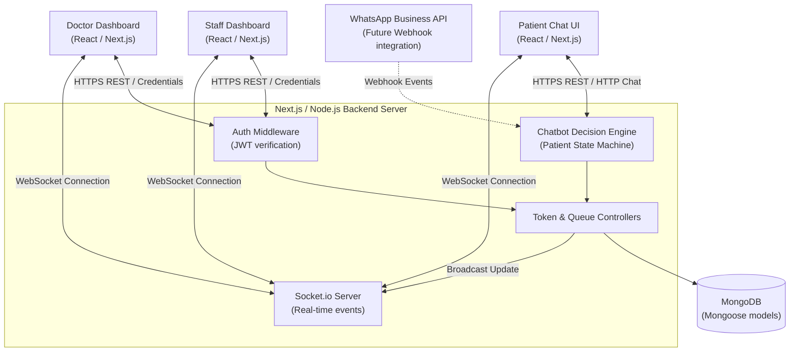

# Implementation Plan - Smart Hospital Queue & Management System

This document outlines the architecture, database schema, API design, and frontend layouts for the **Smart Hospital Queue & Management System**. The system is designed to eliminate physical waiting lines, streamline staff and doctor workflows, and support real-time token/queue synchronization.

---

## 1. System Architecture

Below is a high-level system architecture diagram detailing the relationship between the Patient Chat Interface, Staff Dashboard, Doctor Dashboard, the Express/Next.js backend server, MongoDB database, and the real-time Socket.io layer. It also illustrates how a future **WhatsApp Business API** integration can mirror the chatbot flow.



---

## 2. MongoDB Schemas (using Mongoose)

We will implement six main collections in MongoDB using Mongoose. Referencing will ensure relational integrity (e.g., tokens pointing to doctors and patients, and queues managing arrays of token references).

```javascript
// 1. Patient Schema
const PatientSchema = new mongoose.Schema({
  name: { type: String, required: true, trim: true },
  age: { type: Number, required: true },
  gender: { type: String, enum: ['Male', 'Female', 'Other'], required: true },
  phone: { type: String, required: true, unique: true, index: true },
  visitCount: { type: Number, default: 1 },
}, { timestamps: true });

// 2. Doctor Schema
const DoctorSchema = new mongoose.Schema({
  name: { type: String, required: true, trim: true },
  email: { type: String, required: true, unique: true, index: true },
  passwordHash: { type: String, required: true },
  department: { type: String, required: true },
  specialization: { type: String },
  availabilityStatus: { 
    type: String, 
    enum: ['Available', 'In Surgery', 'On Break', 'Unavailable'], 
    default: 'Available' 
  },
  averageCheckupTime: { type: Number, default: 10 }, // in minutes
  currentRoom: { type: String, required: true } // e.g., "Cabin A"
}, { timestamps: true });

// 3. Staff Schema
const StaffSchema = new mongoose.Schema({
  name: { type: String, required: true, trim: true },
  username: { type: String, required: true, unique: true, index: true },
  passwordHash: { type: String, required: true },
  counterNumber: { type: String, required: true } // e.g., "Counter 1"
}, { timestamps: true });

// 4. Token Schema
const TokenSchema = new mongoose.Schema({
  tokenNumber: { type: String, required: true, unique: true, index: true }, // e.g., "T-102"
  status: { 
    type: String, 
    enum: ['Waiting', 'Called', 'Active', 'Completed', 'Absent', 'Delayed'], 
    default: 'Waiting',
    index: true 
  },
  tokenType: { 
    type: String, 
    enum: ['Regular', 'Re-visit', 'Emergency'], 
    default: 'Regular' 
  },
  patient: { type: mongoose.Schema.Types.ObjectId, ref: 'Patient', required: true },
  doctor: { type: mongoose.Schema.Types.ObjectId, ref: 'Doctor', required: true },
  symptoms: { type: String, required: true },
  chatHistory: [{
    sender: { type: String, enum: ['user', 'bot'] },
    message: { type: String },
    timestamp: { type: Date, default: Date.now }
  }],
  estimatedWaitTime: { type: Number, default: 0 }, // in minutes
  calledAt: { type: Date },
  completedAt: { type: Date }
}, { timestamps: true });

// 5. Queue Schema (Live Queue State Tracker per Doctor)
const QueueSchema = new mongoose.Schema({
  doctor: { type: mongoose.Schema.Types.ObjectId, ref: 'Doctor', required: true, unique: true },
  currentToken: { type: mongoose.Schema.Types.ObjectId, ref: 'Token', default: null },
  activeQueue: [{ type: mongoose.Schema.Types.ObjectId, ref: 'Token' }], // Ordered list of waiting tokens
  isPaused: { type: Boolean, default: false },
  bufferDelay: { type: Number, default: 0 } // Extra manual delay in minutes added by Doctor
}, { timestamps: true });

// 6. Chat Session Schema (Chatbot State Management)
const ChatSessionSchema = new mongoose.Schema({
  sessionId: { type: String, required: true, unique: true, index: true }, // e.g. Socket ID or phone number
  currentState: { 
    type: String, 
    enum: ['WELCOME', 'AWAITING_PHONE', 'AWAITING_NAME', 'AWAITING_AGE', 'AWAITING_GENDER', 'AWAITING_SYMPTOMS', 'COMPLETED'], 
    default: 'WELCOME' 
  },
  tempData: {
    phone: { type: String },
    name: { type: String },
    age: { type: Number },
    gender: { type: String },
    symptoms: { type: String },
    doctor: { type: mongoose.Schema.Types.ObjectId, ref: 'Doctor' }
  },
  lastActivity: { type: Date, default: Date.now, expires: 3600 } // TTL index: auto-expires after 1 hour of inactivity
}, { timestamps: true });
```

### Queue Ordering Logic
- **Priority Placement:** `activeQueue` contains an array of `Token` IDs that are currently waiting.
- **Emergency Insertion:** When a token is marked as `Emergency` (via Staff Dashboard or SOS Chat trigger), the system automatically pushes the token ID to the absolute index `0` of the `activeQueue` array (or directly after other existing emergencies).
- **Cabin Isolation:** Emergency tokens must **never interrupt or overwrite** the `currentToken` (which represents the patient currently inside the doctor's cabin for active checkup).
- **Recalculations:** Whenever a token status changes (called, completed, delayed, or marked emergency), or when a buffer delay is updated, the backend recalculates `estimatedWaitTime` for all subsequent waiting tokens in that doctor's queue. 
  `Wait Time = (Index in Queue * Doctor's averageCheckupTime) + Queue's bufferDelay`.

---

## 3. API Routing Plan

All API endpoints will be structured under `/api/v1/`. JWT middleware is used to enforce secure role access (Doctor or Staff).

### Auth Routing
- `POST /api/v1/auth/doctor/login` - Doctor login, returns JWT + Doctor Details.
- `POST /api/v1/auth/staff/login` - Staff login, returns JWT + Staff Details.
- `GET /api/v1/auth/me` - Validates JWT, returns current session payload.

### Patient Chatbot & Token Flow
- `POST /api/v1/chat/message` - Accepts patient input (text or button response). Keeps session-state in backend to progress user through registration/booking wizard using `ChatSessionSchema`.
- `POST /api/v1/tokens/book` - Explicit endpoint called by chatbot to register patient details and issue a token.
- `GET /api/v1/tokens/:tokenId/status` - Live check of patient's current position and estimated waiting time.

### Staff Queue Control
- `POST /api/v1/staff/tokens/walk-in` - Generates a manual token for walk-in patients (requires Staff authentication).
- `PUT /api/v1/staff/tokens/:tokenId/override` - Promotes token to type `Emergency` and updates priority.
- `PUT /api/v1/staff/tokens/:tokenId/status` - Direct status override (e.g. status set to `Delayed` or `Cancelled`).
- `GET /api/v1/staff/queues` - View all active live queues across all doctors.

### Doctor Cabin Control
- `GET /api/v1/doctor/my-queue` - Returns the logged-in doctor's live queue details (current token + active waiting list).
- `POST /api/v1/doctor/queue/call-next` - Updates the next token in queue to status `Active` and moves it to `currentToken`.
- `POST /api/v1/doctor/queue/complete` - Completes the active patient checkup (moves token status to `Completed`).
- `POST /api/v1/doctor/queue/mark-absent` - Marks the active patient status as `Absent`.
- `POST /api/v1/doctor/queue/add-buffer` - Allows the doctor to add a manual time delay buffer (e.g. +15 mins) which instantly recalculates and broadcasts updated wait times to all waiting patients.
- `PUT /api/v1/doctor/availability` - Updates doctor availability status (`Available`, `In Surgery`, `On Break`) and average checkup times.

### Real-Time WebSocket Event Structure
We will establish room-based real-time communication using Socket.io:
1. **Rooms:**
   - `doctor:[id]` - For doctor-specific dashboard updates.
   - `patient:[tokenId]` - For individual patient live updates.
   - `queue:global` - For staff/overall hospital updates.
2. **Events:**
   - `join-room` (Client -> Server) - Client requests to join a room.
   - `queue-updated` (Server -> Clients) - Sent on state change. Re-fetches current list.
   - `token-called` (Server -> Clients) - Signals to Patient UI that it is their turn (can trigger speech synthesis or browser alert).
   - `doctor-status-update` (Server -> Clients) - Instantly updates doctor's current availability on dashboards.

---

## 4. UI/UX Wireframe Layout Descriptions

The UI will use modern HSL-based color palettes (e.g., Deep Slate `#0F172A`, Vivid Teal `#0D9488`, Crimson SOS `#E11D48`) and Inter typography, prioritizing clean visual hierarchy.

### A. Patient Interface (Chat-First Landing Page)
- **Visuals:** Full-screen chat layout with a sleek modern messaging interface. Solid dark theme background with a centered bubble for chatting.
- **Components:**
  1. **Chat Header:** Hospital logo, online indicator, and a subtitle ("AI Queue Assistant").
  2. **Message Stream:** Scrollable log of system welcome messages, text outputs, and user answers.
  3. **Quick-Reply Cards:** Floating horizontal cards (clickable buttons) for core actions:
     - `Book New Appointment` / `Re-visit` / `Check Live Status` / `Emergency SOS`.
  4. **Chat Input:** Simple typing area for Name, Age, and Symptoms.
  5. **Token Detail Card (Conditional):** Once a token is successfully generated, a persistent sleek glowing floating widget displays:
     - Large text: **Token T-102**
     - Subtext: "Status: 3 Patients ahead. Est: 30 mins."
     - Animated pulse ring indicating live connection.

### B. Staff Dashboard
- **Visuals:** Dual-pane widescreen dashboard optimized for fast workflow. 
- **Components:**
  1. **Top Bar:** Staff identifier, designated counter tag ("Counter 1"), and sign-out button.
  2. **Left Pane (Walk-in Booking):** A clean form to register manual walk-ins:
     - Input fields: Name, Age, Symptoms selection, Doctor drop-down.
     - Priority Select: Standard / Emergency SOS toggle.
     - Big action button: `Generate Walk-in Token`.
  3. **Right Pane (Hospital Queue Overview):** 
     - Interactive tabs for each Doctor.
     - List of tokens showing index, number, symptoms, and priority badge.
     - Actions on hover: `Call Next` (for their specific counter), `Delay Token`, `Mark Emergency` (the SOS override button).

### C. Doctor Dashboard
- **Visuals:** Highly intuitive split-screen with dark/light mode toggle. A clear status-indicator widget on the top right.
- **Components:**
  1. **Top Header:** Doctor details, Department, current Availability dropdown picker (`Available`, `In Surgery`, `On Break`).
  2. **Left Panel (Live Waiting Queue):** 
     - A vertical stack of patients currently waiting.
     - Emergency tokens sit at the top, highlighted in flashing red borders with an "EMERGENCY" badge.
     - Next Up patient has an "Up Next" soft green outline.
  3. **Center Panel (Current Patient Cabin Details):** 
     - Active patient's Name, Age, and symptoms summary.
     - Expansion card showing the **chatbot conversation history** to give full symptom context.
  4. **Right Control Panel (Cabin Action Panel):** 
     - Large prominent buttons:
       - **Call Next Patient** (Primary action, triggers voice announcement).
       - **Complete Checkup** (Concludes active session).
       - **Mark Absent** (Frees room if patient didn't show).
       - **Pause Queue / Delay** (Allows doctor to pause intake).
       - **Add Buffer Delay** (Time input fields and buttons to add manual offsets like +10, +15, +30 mins).

---

## 5. Verification Plan

### Automated Verification
1. **Schema Validation Tests:** Unit tests validating Mongoose constraints, ensuring unique token indices, and reference validation.
2. **Queue Insertion Tests:** Automated script inserting multiple standard tokens followed by an emergency token to assert that the emergency token moves to index 0 of `activeQueue`.
3. **API Integration Tests:** Postman/Supertest scripts targeting REST auth endpoints and status update routes.
4. **Mock Socket Events:** Test scripts simulating multiple clients (doctor, staff, patient) joining and verifying real-time propagation of `queue-updated` events.

### Manual Verification
1. **Real-time Synchronization Run:** Open Patient UI on a mobile browser and Doctor/Staff UI on Desktop. Perform walk-in generation and verify the live dashboards instantly update without reloading.
2. **Emergency Escalation Verification:** Verify the UI displays visual flashing cues (Crimson SOS) when emergency status is activated.
3. **Chatbot Flow Inspection:** Walk through the complete booking wizard from "Hi" through symptom input to confirm correct token delivery.

---

## 6. System Maintenance

### Midnight Token Reset & Archival
To keep operations performing optimally and maintain database cleanups, a scheduled background job will run daily:
- **Execution Interval:** Scheduled using a node-cron expression: `0 0 * * *` (Every night at 12:00 AM).
- **Core Operations:**
  1. **Archive Old Tokens:** All completed, absent, or cancelled tokens from the previous day are moved or flagged in an archive collection (`ArchivedToken`) or marked with a historical index to clear active indices.
  2. **Active Queue Flush:** All doctor `activeQueue` arrays are cleared. Current cabin token (`currentToken`) pointers are reset to null.
  3. **Reset Token Generator Sequence:** The global or doctor-specific counter used to generate token serials (e.g. starting back at T-101 or T-1) is reset to 1.
  4. **State Cleanup:** Active chat sessions matching `ChatSessionSchema` that are older than 24 hours are deleted.

---

## 7. Open Questions

> [!IMPORTANT]
> **Authentication Detail:**
> Should patient phone numbers be authenticated via OTP (e.g. Firebase or Twilio) during chatbot flow, or is simple text input sufficient for the initial demo?
>
> **Multi-Doctor Scaling:**
> For the landing page status check, does the user query the queue of a specific doctor, or should they query using their token number directly (cross-referencing the doctor automatically)?
